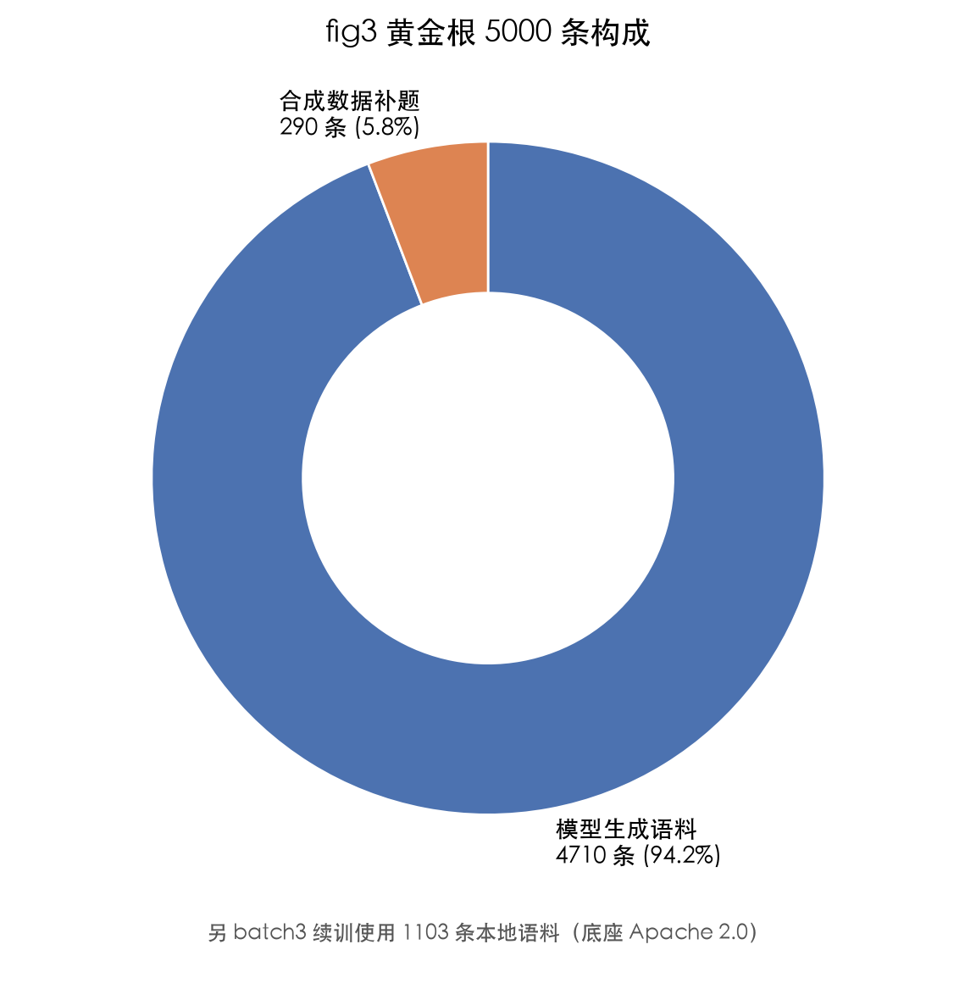
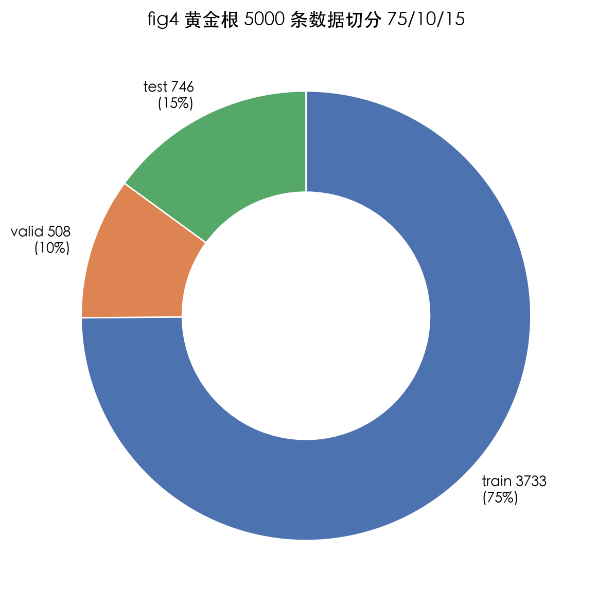
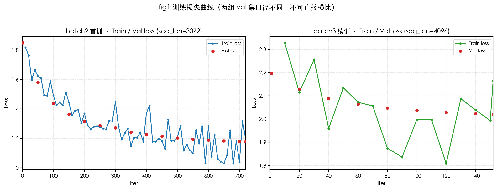
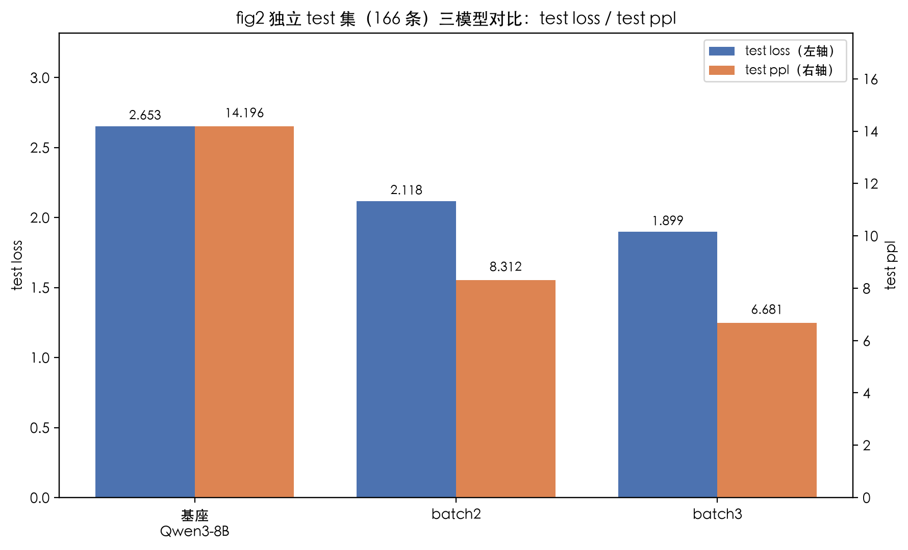

# chunjiang1.0：面向 A 股量化复盘的投资决策审查与纠错模型

> 技术报告 v0.1 · 2026-10-07 · 作者 chunjiang1.0 Team

## 摘要

本文介绍 chunjiang1.0，一个面向投资决策审查与纠错任务的 LoRA 微调模型。模型不用于生成投资观点或预测行情，而是针对给定的投资方案与复盘材料，完成硬伤识别、数字核对、账户约束检查和唯一决策输出。基座模型为 Qwen3-8B，训练方式为本地 MLX LoRA 三轮微调；训练语料采用决策审查三元组（中文题对中文答案），主要来源于模型生成数据。最终模型在 batch3 独立测试集（166 条）上取得 test loss 1.899（ppl 6.681）；同口径下，基座为 2.653，batch2 为 2.118，续训后损失继续下降。本文同时说明训练语料的来源、许可边界，以及当前仅开源方法论与脚本、不公开权重的原因。

## 1. 引言与定位

通用金融大模型（FinGPT、FinBERT 等）通常聚焦于情绪分类、实体识别和行情预测等任务。chunjiang1.0 关注的是更具体的场景：A 股量化复盘中的投资决策审查与纠错。

在该设定下，模型的职责是对既有方案进行审查，包括识别方案中的硬伤、核对关键数字、判断动作是否违反账户硬约束，并在给定信息范围内输出唯一决策。模型不承担开放式行情预测任务，也不被定义为覆盖研究、交易和风控全流程的通用投资系统。

因此，本文讨论的是一个审查型模型，而不是投资观点生成模型。后续的数据设计、训练方法和评测口径均围绕这一边界展开。

## 2. 数据：决策审查三元组

### 2.1 语料构成

训练目标字段为 `{prompt → content}`，即中文题目到中文答案的映射。思考链（reasoning）不进入训练目标；本项目提取的是可执行的审查输出，而不是推理过程文本。

| 来源 | 条数 | 占比 | 许可状态 |
|---|---|---|---|
| 模型生成语料 | 4710 | 94.2% | 来源受限 |
| 合成数据补题 | 290 | 5.8% | 来源受限 |
| 本地生成语料 | 1103 | 已并入（batch3 续训） | 底座 Apache 2.0 |

去重口径为：同一 id 下保留 content 非空且最长的一条。采用这一规则是因为重蒸样本通常更完整，而按时间戳取最新可能引入空答案的失败重蒸样本。

### 2.2 数据准备

1. 合并去重，形成黄金根 5000 条，其中有效 4988 条；12 条空 content 坏题被剔除。
2. 转换为 mlx-lm completions 格式。
3. 按维度分层切分 75/10/15。5000 语料切分结果为 train 3733 / valid 508 / test 746，各决策维度在三部分中均有覆盖，以降低泄漏和记忆化评测风险。

> 注：batch3 续训另用 1103 条本地审查语料的 75/10/15 切分（train 827 / valid 110 / test 166，seed 42）。本文 §5 的 test loss 以后者（166 条）为准；两组 test 集不同，不可混用。

## 3. 方法

- 基座：Qwen3-8B（4-bit，mlx-community）。
- 微调方式：MLX LoRA，rank 8，16 层，scale 20，dropout 0.05，mask_prompt。
- 三轮训练：
  - batch2：全量语料 4987 条，720 iters，val loss 1.177。
  - batch3：本地模型批 1103 条续训，152 iters，val loss 2.021（2.196→2.021 单调下降，lr 2e-5 = batch2 峰值的 1/3，用于降低小样本续训对已学权重的覆盖风险）。
- 序列长度 4096，优化器 adamw（weight_decay 0.01）。

## 4. 评测体系（五维，非 EM/F1 一刀切）

1. 结论类别 macro-F1（买/卖/持分类别报）。
2. 关键因子加权召回（是否点到营收/政策/估值等关键决策因子）。
3. 无依据因子率（编造数据占比）。
4. 证据忠实度（数字/推理能否追溯到题目）。
5. LLM-as-a-Judge（匿名随机化，先在人工双标子集校准）。

当前实现状态（2026-10-07 实测，详见 `test-report.md`）如下：

- D1（macro-F1）：设计未实现。本轮 test 集（166 条）为压力测试/风控问答，不包含「买/卖/持」标注体系，因此无法计算分类别 macro-F1。
- D2（关键因子加权召回）：设计未实现，当前没有因子到权重的标注表。
- D3/D4：仅产出代理口径，即数字字面可追溯率。生成答案数字对题面的字面忠实度为 0.3519，字面无依据率为 0.6481。该代理口径会将由题面数字推导出的数字判为不可追溯，因此不等同于真实编造率；真实 D3/D4 仍需人工或 LLM 判定，尚未实现。
- D5（LLM-as-a-Judge）：设计未实现，尚未建立人工双标校准子集。

也就是说，五维评测中 3 项尚未实现，2 项目前只给出代理数字。本文不基于这些未闭环指标给出模型质量结论。

## 5. 结果

### 5.1 训练期验证损失（各自 val 集，不可直接横比）

- batch2（全量首训）：720 iters，val loss 1.177（val 集=`data/train` valid 508，`max_seq_length=3072`）。
- batch3（续训）：152 iters，val loss 从 2.196 单调降至 2.021，无过拟合拐点（val 集=独立 valid 集 110，`max_seq_length=4096`）。

### 5.2 独立 test 集评估（主结果）

口径：`mlx_lm.tuner.trainer.evaluate()`，`mask_prompt=true`（只计 completion 损失）、`max_seq_length=4096`、`batch_size=6`、`test_batches=-1`，test 集 166 条。命令与日志见 `test-report.md` §1.2。

| 模型 | test loss | test ppl |
|---|---|---|
| 基座 Qwen3-8B（无 adapter） | 2.653 | 14.196 |
| batch2（全量首训 adapter） | 2.118 | 8.312 |
| **batch3（续训 adapter，本文主模型）** | **1.899** | **6.681** |

相对基座，batch3 的 test loss 下降 28.4%。在该测试口径下，续训后的损失低于 batch2 和基座。

> 说明：本节为 2026-10-07 实测复现结果；论文 v0.1 曾记 `1.901 / 6.695`（查无落盘证据），实测为 `1.899 / 6.681`，差 0.002，属复现级一致，定稿以实测为准。

### 5.3 发布门槛自测

见 `test-report.md`：数据准备冒烟（50 条，可复现）通过；`test_*.py` 4 个中 3 绿 1 红（`test_flash_quality.py` 直连 401）；五维评测部分实现（见 §4）。

## 6. 开源边界与许可

- 开源：训练/评估脚本、方法论文档、模型卡（Apache 2.0，基座同许可，可商用）。
- 暂不公开：训练语料、评测集、模型权重。
- 原因：语料主体约 94% 为模型生成语料，来源与授权信息有限；另含少量合成数据。基于当前许可状态，语料与权重暂不对外发布，仅公开可复现的方法论与脚本。

## 7. 局限与未来工作

- 数据量是主要瓶颈：当前有效语料约 4988 条，距规模化微调仍有距离。
- 评测口径尚未闭环：第 4 章五维评测中，D1/D2/D5 尚未实现（本轮 test 集无「买/卖/持」标注体系、无因子权重表、无人工双标校准子集），D3/D4 仅给出「数字字面可追溯率」代理。因此，本文仅报告损失类指标，不据此宣称模型已经具备稳定的审查质量。
- test loss 仅在 batch3 的 166 条 test 集上测得，与 §2.2 所述 5000 语料切分（test 746）不是同一 test 集；后者尚未评估。
- 发布门槛自测未全绿（见 `test-report.md` §1.5：`test_flash_quality.py` 直连 401；`test_candidates.py` 样本源字段为空致测试无效）。
- 评测集需要进一步独立化与扩充，以降低样本记忆化和同源评测导致的偏差。
- 未来方向包括扩充数据源（历史复盘、决策账本、错误案例转三元组）、建立评测对标（vs 纯 prompt 注入 vs 更强基座），以及在许可边界内探索权重公开路径。
- 免责：本文与模型输出均为投资决策审查工具的研究产物，不构成任何投资建议；不提供行情预测，也不对任何交易的盈亏负责。

## 参考文献

- Qwen3 Technical Report（基座）。
- MLX / mlx-lm（Apple，本地微调框架）。
- Mitchell et al., *Model Cards for Model Reporting*, FAT* 2019（模型卡范式）。
